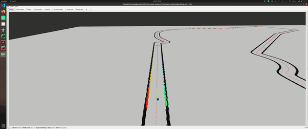

# MPC racing controller made in ros2-rust


This is an example package of using ros2-rust client library
to do some applied robotics task. 

## Dependencies
* [ros2-rust](https://github.com/ros2-rust/ros2_rust)
* [f1tenth-gym](https://github.com/f1tenth/f1tenth_gym)
* [OpEn optimzer](https://alphaville.github.io/optimization-engine/)

## Quickstart

Make sure that you install deps in your workspace.

```bash
cd ws/src
git clone https://github.com/AlexKaravaev/rust_mpc
cd .. && colcon build
```

You can tune mpc controller(for example to include laserscan and obstacles) 
by changing file src/create_solver.py and running ```python3 create_solver.py```

Also there are couple of racing maps included in this repo:
* Monza
* Silverstone

To change the map simply change the name in config/sim.yaml. 
Also you can download more race tracks from [f1tenth racing repo](https://github.com/f1tenth/f1tenth_racetracks)
